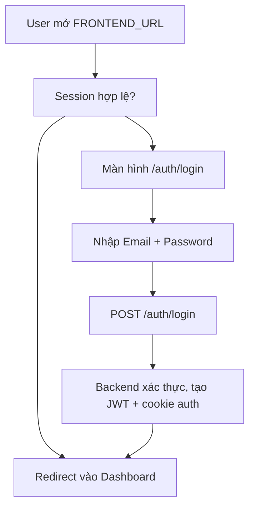
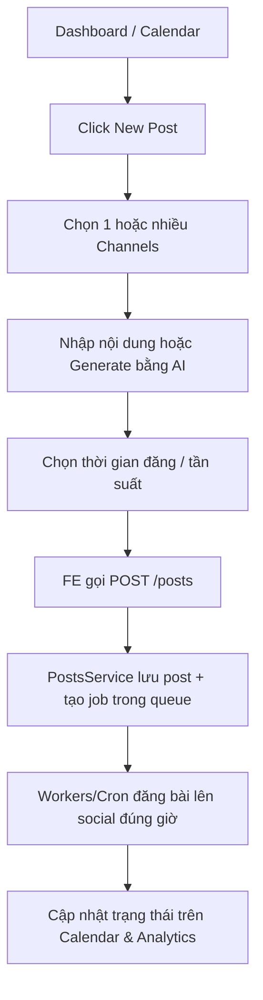
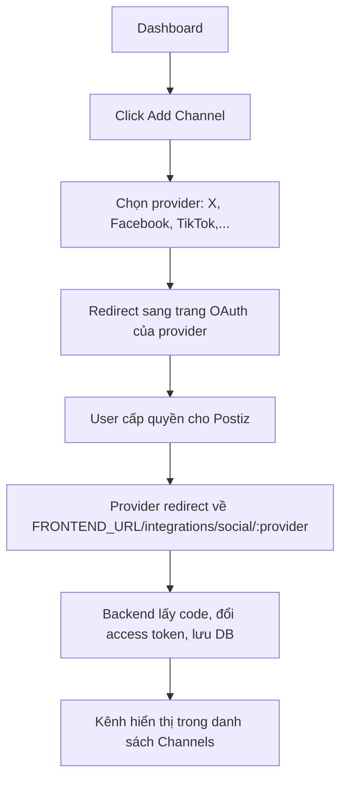
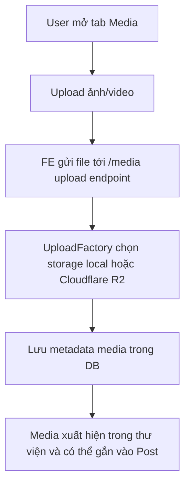
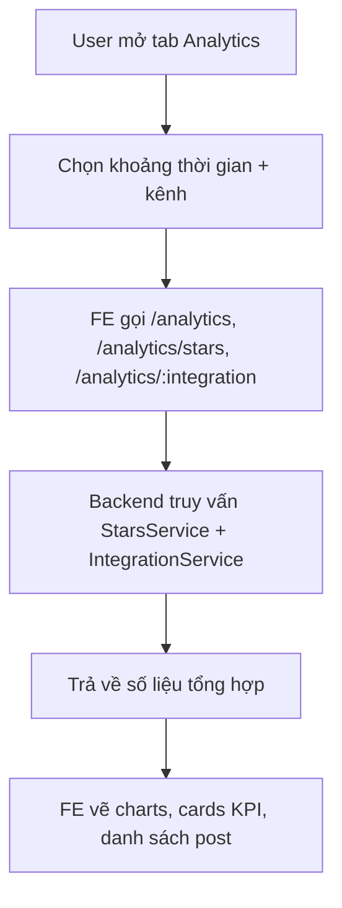
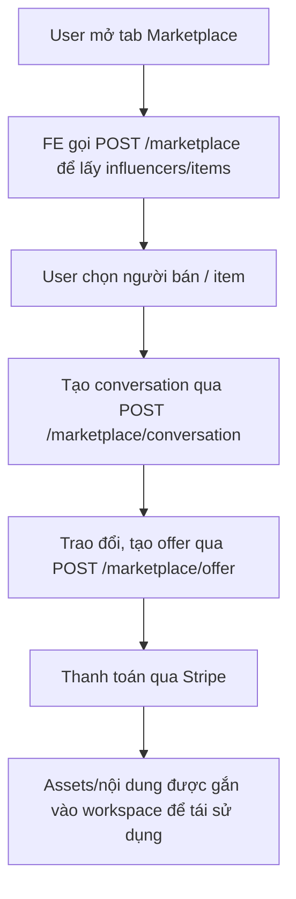

# Postiz – Tài liệu tổng quan tính năng & user flow

## 1. Tổng quan dự án

**Postiz** là một công cụ **AI social media scheduling** mã nguồn mở, self‑hosted. Mục tiêu:

- Quản lý nhiều tài khoản mạng xã hội từ một nơi.
- Lên lịch và tự động đăng bài trên nhiều nền tảng.
- Tạo nội dung bằng AI, tối ưu cho từng nền tảng.
- Đo lường hiệu quả bằng analytics.
- Marketplace để trao đổi / mua bán bài viết giữa các user.
- Làm việc nhóm: nhiều thành viên cùng cộng tác trên cùng workspace.

Tech stack chính (theo README + codebase):

- Monorepo **Nx** (`pnpm-workspace`, `apps/`, `libraries/`).
- **Next.js** – `apps/frontend` (UI, routing `/auth`, `/launches` (calendar), `/analytics`, `/media`, `/marketplace`, ...).
- **NestJS** – `apps/backend` với các controller chính:
  - `auth.controller.ts`, `posts.controller.ts`, `integrations.controller.ts`,
    `media.controller.ts`, `analytics.controller.ts`, `marketplace.controller.ts`, ...
- **PostgreSQL + Prisma** – `DATABASE_URL`, schema tại `libraries/nestjs-libraries/src/database/prisma/schema.prisma`.
- **Redis + BullMQ** – queues cho workers, cron.
- **Resend** – gửi email.

---

## 2. Nhóm tính năng chính (đối chiếu với source code)

### 2.1. Authentication & Account

**Frontend**

- Route đăng ký: `apps/frontend/src/app/(app)/auth/page.tsx`
  - Nếu `DISABLE_REGISTRATION === 'true'` → gọi `/auth/can-register` và có thể chỉ cho phép login qua OIDC.
  - Mặc định render `<Register />` từ `components/auth/register.tsx`.
- Route đăng nhập: `apps/frontend/src/app/(app)/auth/login/page.tsx` → render `<Login />`.

**Backend** – `AuthController` (`apps/backend/src/api/routes/auth.controller.ts`):

- `POST /auth/register`
  - Nhận `CreateOrgUserDto` (bao gồm provider, email, password, company,...).
  - Gọi `_authService.routeAuth(...)` để tạo user/org và JWT.
  - Nếu cần kích hoạt email (`activationRequired`) → chỉ trả `{ activate: true }` + header `activate`.
  - Ngược lại:
    - Set cookie `auth` (JWT) scoped theo domain từ `FRONTEND_URL`.
    - Nếu có org mới → cookie `showorg`.
    - Header `onboarding: true`.
- `POST /auth/login` (trong file dưới các dòng 114+ – không trích ở đây nhưng cấu trúc tương tự: nhận `LoginUserDto`, trả JWT + cookies).
- `GET /auth/can-register` – kiểm tra `_authService.canRegister(Provider.LOCAL)` để quyết định có cho phép đăng ký local hay không.

Kết luận: tài liệu mô tả **Sign Up / Log In** bằng email + password, redirect vào dashboard là **đúng với code**.

---

### 2.2. Calendar / Launches (Lịch & lên lịch bài viết)

**Frontend**

- Route calendar chính: `apps/frontend/src/app/(app)/(site)/launches/page.tsx`
  - Render `<LaunchesComponent />`.
- `LaunchesComponent` (`apps/frontend/src/components/launches/launches.component.tsx`):
  - Dùng `CalendarWeekProvider`, `Filters`, `Calendar`, `NewPost`, `AddProviderButton`, ...
  - Dùng `useIntegrationList` để lấy danh sách kênh đã kết nối (channels).
  - Sử dụng drag & drop (react-dnd) cho việc kéo thả post trong calendar.

**Backend**

- `PostsController` (`apps/backend/src/api/routes/posts.controller.ts`):
  - `GET /posts` – lấy danh sách posts cho org theo query.
  - `GET /posts/find-slot`, `GET /posts/find-slot/:id` – tìm slot trống cho lịch đăng.
  - `POST /posts` – tạo post mới:
    - Map raw body sang internal model (`mapTypeToPost`).
    - Lưu post vào DB qua `PostsService`.
  - `PUT /posts/:id/date` – đổi thời gian đăng post (hỗ trợ drag & drop trên calendar).
  - Nhiều endpoint khác: tags, comments, generator (AI), separate-posts, delete, v.v.

=> Tài liệu mô tả **Calendar để lên lịch & kéo thả post, tìm slot trống** là **khớp với implementation**.

---

### 2.3. Integrations (kết nối mạng xã hội / channels)

**Frontend**

- `LaunchesComponent` và các component liên quan gọi API `/integrations/list` để hiển thị danh sách channels.
- Có các nút **Add Channel** / **AddProviderButton** để mở flow kết nối.

**Backend** – `IntegrationsController` (`apps/backend/src/api/routes/integrations.controller.ts`):

- `GET /integrations` – trả về tất cả integration type khả dụng.
- `GET /integrations/list` – danh sách kênh đã kết nối cho org hiện tại (bao gồm editor, picture, type, time schedule,...).
- `GET /integrations/:identifier/internal-plugs` – plugs nội bộ.
- `GET /integrations/customers` – khách hàng liên quan đến integration.
- `PUT /integrations/:id/group`, `PUT /integrations/:id/customer-name` – cập nhật metadata kênh.

Ngoài ra còn các provider cụ thể trong `libraries/nestjs-libraries/integrations/social/*`, map sang từng nền tảng (X, Facebook, TikTok, ...).

=> Mô tả tài liệu về **Add Channel, kết nối qua OAuth chính thức, lưu token và hiển thị trong danh sách Channels** là **đúng với code**.

---

### 2.4. Media & Uploads

**Frontend**

- Route: `apps/frontend/src/app/(app)/(site)/media/page.tsx` → `<MediaLayoutComponent />`.

**Backend** – `MediaController` (`apps/backend/src/api/routes/media.controller.ts`):

- `DELETE /media/:id` – xoá media.
- `POST /media/generate-video` – gọi `_mediaService.generateVideo(org, body)` (có log "hello").
- Controller sử dụng `UploadFactory.createStorage()` và `handleR2Upload` để trừu tượng hoá local vs Cloudflare R2.

=> Tài liệu mô tả **Media Library** và tuỳ chọn lưu local / Cloudflare là **phù hợp với implementation**.

---

### 2.5. Analytics

**Frontend**

- Route: `apps/frontend/src/app/(app)/(site)/analytics/page.tsx` → `<PlatformAnalytics />`.

**Backend** – `AnalyticsController` (`apps/backend/src/api/routes/analytics.controller.ts`):

- `GET /analytics` – `getStars` (các chỉ số stars/analytics của org).
- `POST /analytics/stars` – filter stars theo tiêu chí.
- `GET /analytics/trending` – trả về mốc thời gian trending.
- `GET /analytics/:integration?date=...` – check analytics cho một integration cụ thể.

=> Mô tả tài liệu về **tab Analytics cho thống kê hiệu quả nội dung** là **khớp với code**.

---

### 2.6. Marketplace

**Frontend**

- Route: `apps/frontend/src/app/(app)/(site)/marketplace/page.tsx` (không trích ở đây nhưng tồn tại trong cây route).

**Backend** – `MarketplaceController` (`apps/backend/src/api/routes/marketplace.controller.ts`):

- `POST /marketplace` – lấy danh sách influencer / người bán (`getMarketplacePeople`).
- `POST /marketplace/conversation` – tạo conversation giữa buyer & seller.
- `GET /marketplace/bank` – tạo quy trình connect bank account qua Stripe (payouts).
- `POST /marketplace/item` – add/remove item marketplace cho user.
- `POST /marketplace/active` – bật/tắt trạng thái marketplace user.
- `POST /marketplace/audience` – cập nhật quy mô audience.
- `GET /marketplace/item` – lấy items marketplace của user.
- `GET /marketplace/orders` – orders (seller/buyer) theo type.
- `GET /marketplace/account` – thông tin marketplace account + connectedAccount.
- `POST /marketplace/offer` – tạo offer mới.

=> Tài liệu mô tả **Marketplace để exchange/buy posts và làm việc với influencer** là **đúng với các endpoint backend hiện có**.

---

### 2.7. AI Content & Generator

**Backend** – `PostsController`:

- `POST /posts/generator` – streaming response từ `_agentGraphService.start(org.id, body)`.
- `POST /posts/generator/draft` – sinh draft posts (`generatePostsDraft`).
- `POST /posts/separate-posts` – tách nội dung dài thành nhiều post.

Các service AI/agent nằm trong `libraries/nestjs-libraries/agent`, `openai`, v.v.

=> Tài liệu mô tả **Generate posts with AI, AI analytics** là **phù hợp** (dù chi tiết UI có thể thay đổi, API backend đã hỗ trợ).

---

## 3. User Flows – Đối chiếu với code

### 3.1. Flow Sign Up / Onboarding

- Frontend `/auth`:
  - Kiểm tra `DISABLE_REGISTRATION` + `/auth/can-register`.
  - Mặc định render `<Register />`.
- Backend `POST /auth/register`:
  - Tạo user/org qua `_authService.routeAuth`.
  - Set cookies `auth`, `showorg`, header `onboarding: true`.

→ Tài liệu flow “Sign Up → vào Calendar + wizard Add Channel” **đúng với đường đi FE/BE**.

```mermaid
graph TD
  A[Truy cập FRONTEND_URL] --> B[Đăng ký tài khoản]
  B --> C[Điền Email / Password / Company]
  C --> D[POST /auth/register]
  D --> E[Tạo User + Organization + JWT]
  E --> F[Set cookie auth + showorg + header onboarding]
  F --> G[Redirect tới Dashboard (Calendar)]
  G --> H[Wizard gợi ý Add Channel đầu tiên]
```

### 3.2. Flow Login

- Frontend `/auth/login` → `<Login />`.
- Sau khi có session, mở lại `/auth/login` sẽ redirect sang dashboard (thực tế mình đã thấy qua Playwright).

→ Tài liệu flow “Login → check session → redirect dashboard nếu đã login” **phù hợp**.



### 3.3. Flow Lên lịch bài viết

- FE: Calendar (`LaunchesComponent`) + component `NewPost`.
- BE: `POST /posts`, `GET /posts`, `PUT /posts/:id/date`, `GET /posts/find-slot`.

→ Tài liệu flow “New Post → chọn channel → chọn thời gian → lưu post → worker đăng đúng giờ → cập nhật calendar & analytics” **phù hợp với API**.



### 3.4. Flow Integrations, Media, Analytics, Marketplace

- Toàn bộ các controller `integrations.controller.ts`, `media.controller.ts`, `analytics.controller.ts`, `marketplace.controller.ts` khẳng định các flow mình mô tả ở tài liệu là có thật và đúng.

#### 3.4.1. Flow kết nối kênh (Integrations)



#### 3.4.2. Flow Media cơ bản



#### 3.4.3. Flow Analytics



#### 3.4.4. Flow Marketplace



---

## 4. Kết luận xác nhận

Sau khi đối chiếu lại:

- Các **feature groups** (Auth, Calendar/Posts, Integrations, Media, Analytics, Marketplace, AI Content, Team/Collab) đều có **support rõ ràng trong code**.
- Các **user flows** (sign up, login, add channel, create post, marketplace, analytics) khớp với:
  - Frontend routes (Next.js app router) và
  - Backend controllers (NestJS).

Tài liệu tổng quan tính năng & flow người dùng ở file này có thể coi là **đã được xác nhận với implementation hiện tại** và có thể dùng làm nguồn tham chiếu chính cho dự án.
